# System
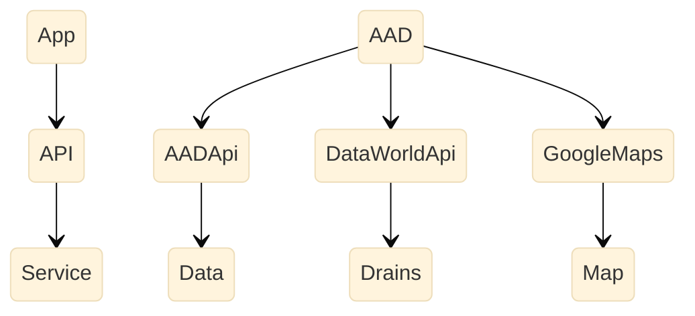

# MyAdoptees
 
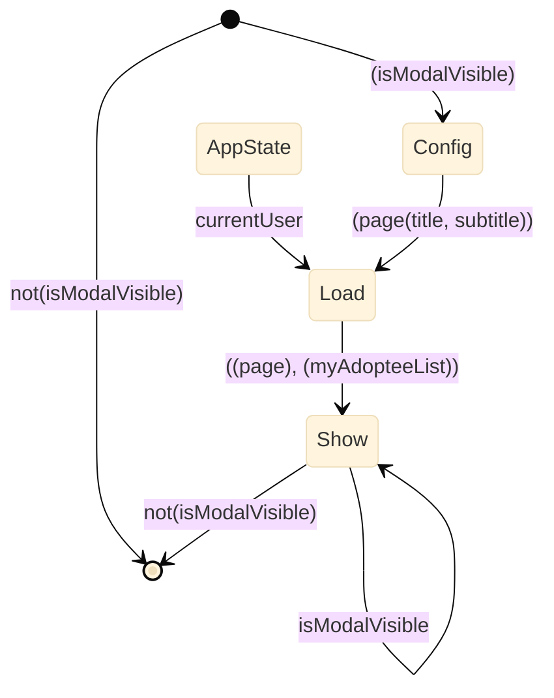
  
# MyAdoptees *Show
 
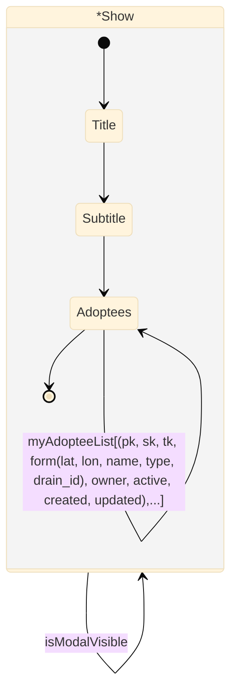
  
# MyAdoptees *Load
 
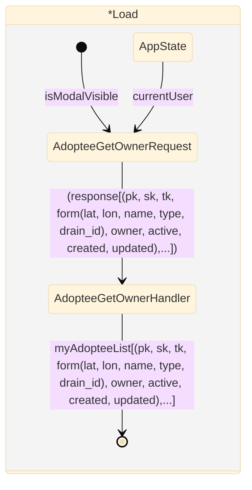

 
# About
 
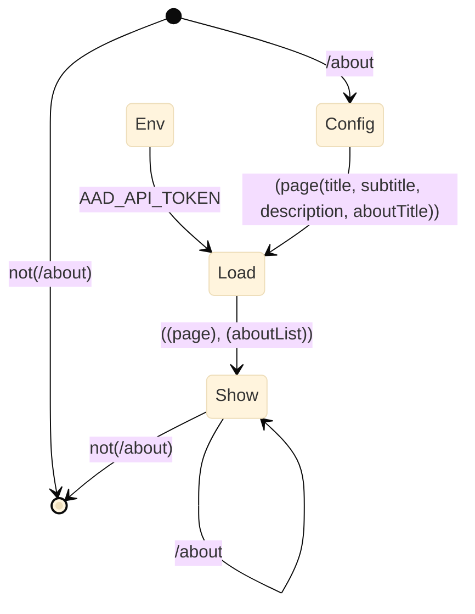
  
# About *Load
 
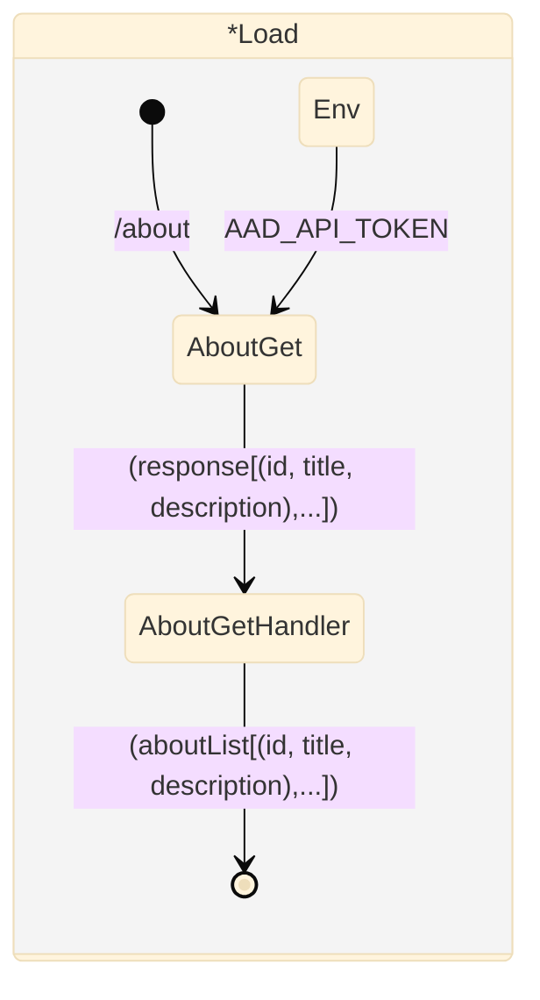
  
# About *Show
 
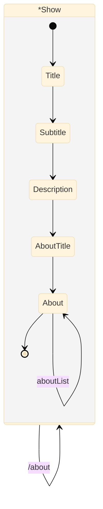

# Adoption
 
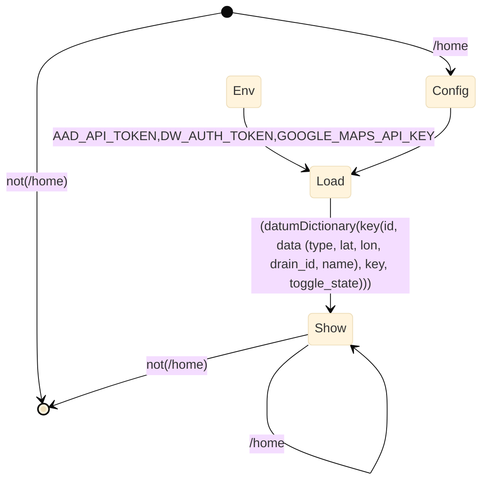
  
# Adoption *Load
 
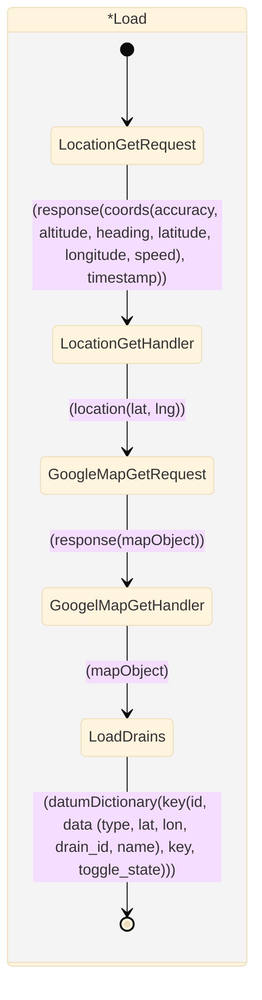
  
# Adoption *LoadDrain
 
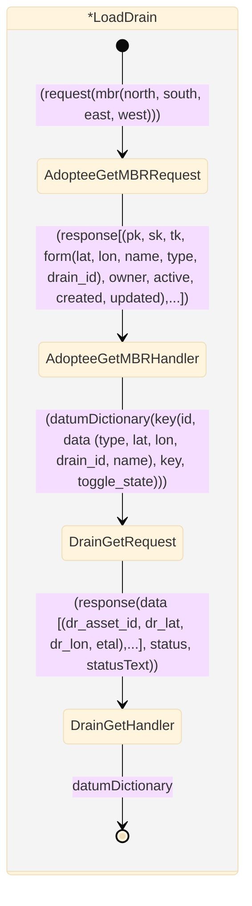
  
# Adoption *Show
 
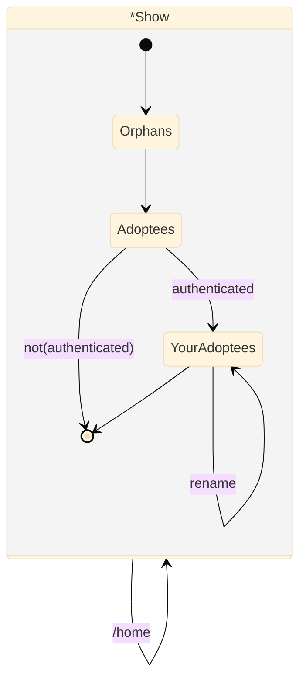
  
# Adoption *YourAdoptees
 
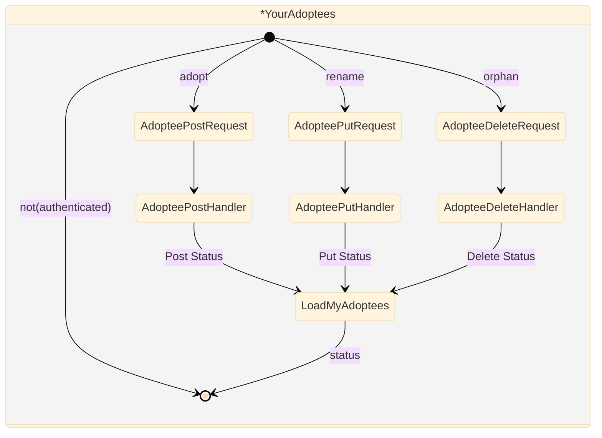

# Communities
 
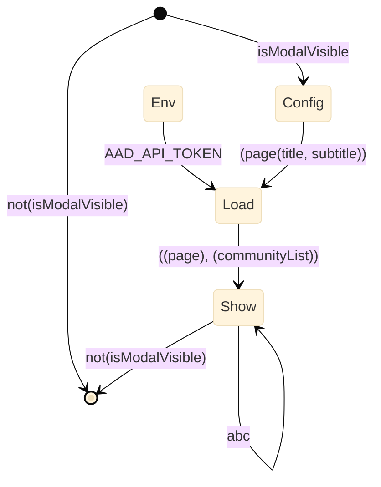
  
# Communities *Load
 
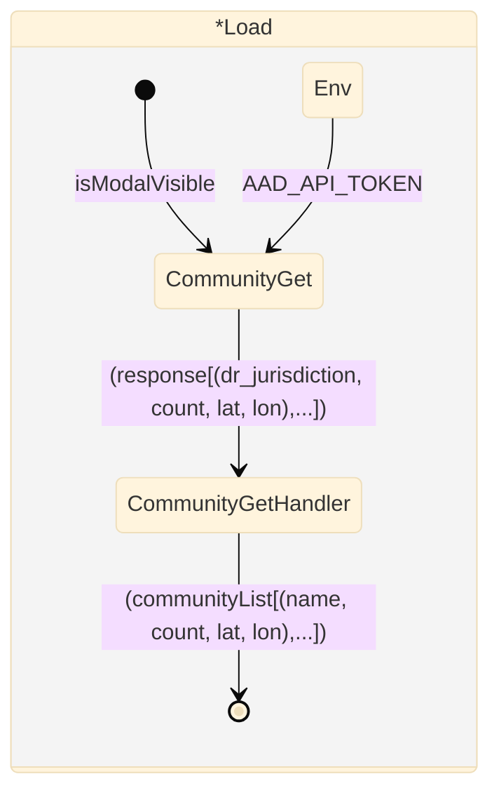
  
# Communities *Show
 
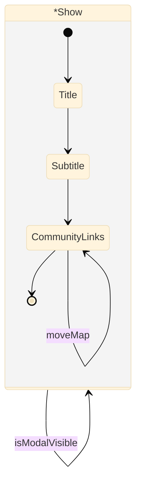

# Footer
 
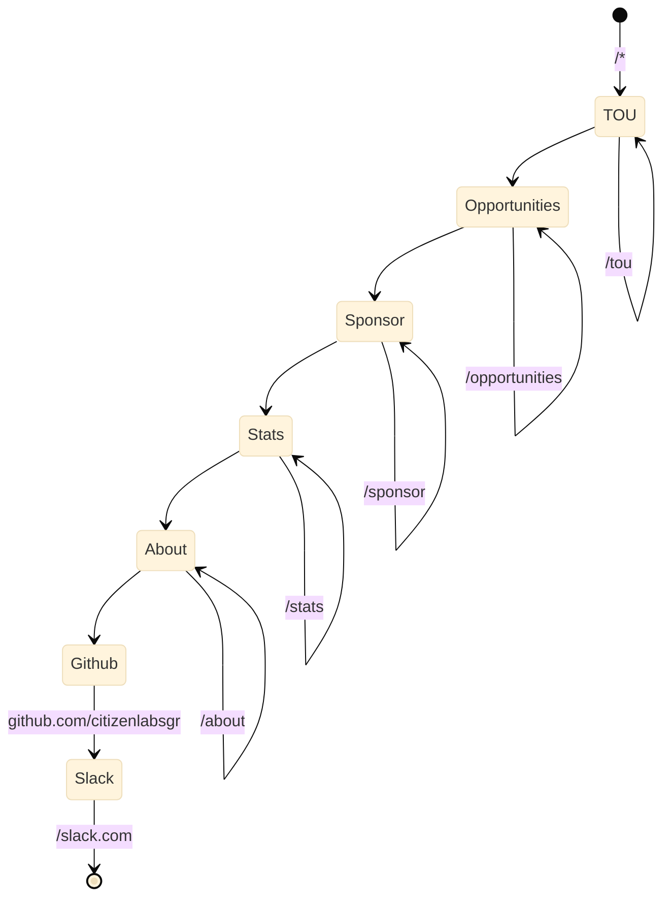


# Header
 
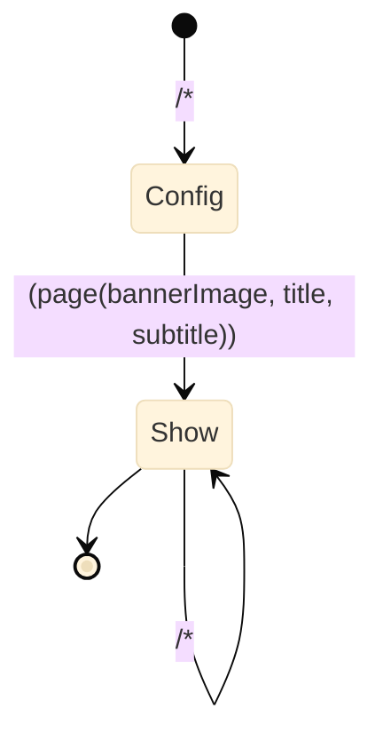
  
# Header *Show
 
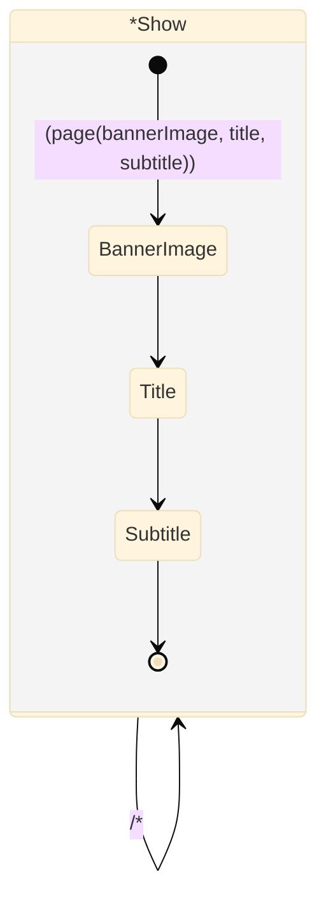

# Home
 
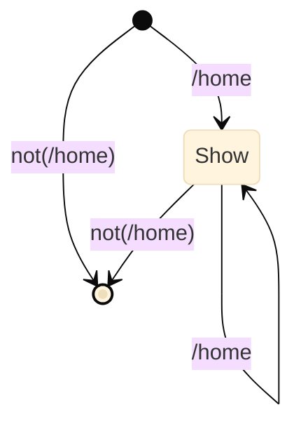
  
# Home *Show
 
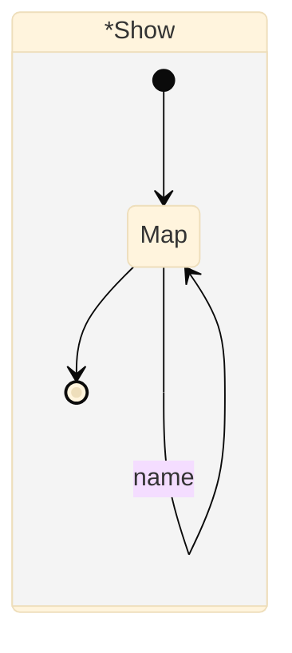

# Nav
 
```mermaid

%%{init: {'securityLevel': 'loose', 'theme':'base'}}%%
stateDiagram
 
[*] --> Adoptions : /*
Adoptions --> Communities
Communities --> Signup : not(authenticated)
Communities --> MyAdoptees : authenticated
Signup --> Signin
Signin --> [*] : not(authenticated)
MyAdoptees --> SignOut
SignOut --> [*]
 
Adoptions --> Adoptions : /
Communities --> Communities : isModalVisible
Signup --> Signup : /adopter
Signin --> Signin : isModalVisible
MyAdoptees --> MyAdoptees : isModalVisible
SignOut --> SignOut : isModalVisible
 
```

# Opportunities
 
```mermaid

%%{init: {'securityLevel': 'loose', 'theme':'base'}}%%
stateDiagram
 
[*] --> [*] : not(/opportunities)
[*] --> Config : /opportunities
Env --> Load : AAD_API_TOKEN
Config --> Load : (page(title, subtitle, description, opportunityTitle))
Load --> Show : (page), (opportunityList)
Show --> [*] : not(/opportunities)
 
Show --> Show : /opportunities
 
```
  
# Opportunities *Load
 
```mermaid

%%{init: {'securityLevel': 'loose', 'theme':'base'}}%%
stateDiagram
 
 state *Load
     {
    [*] --> OpportunityGet : /opportunities
    Env --> OpportunityGet : AAD_API_TOKEN
    OpportunityGet --> OpportunityGetHandler : (response[(id, title, description),...])
    OpportunityGetHandler --> [*] : (opportunityList[(id, title, description),...])
  }
 
 
```
  
# Opportunities *Show
 
```mermaid

%%{init: {'securityLevel': 'loose', 'theme':'base'}}%%
stateDiagram
 
 state *Show
     {
    [*] --> Title
    Title --> Subtitle
    Subtitle --> Description
    Description --> OpportunityTitle
    OpportunityTitle --> Opportunities
    Opportunities --> [*]
  }
 
*Show --> *Show : /opportunities
Opportunities --> Opportunities : opportunityList
 
```


# Signin
 
```mermaid

%%{init: {'securityLevel': 'loose', 'theme':'base'}}%%
stateDiagram
 
[*] --> [*] : not(isModalVisible)
[*] --> [*] : (authenticated)
Env --> Authenticate : AAD_API_TOKEN
Config --> Show : (page(title, subtitle, feedback))
Show --> [*] : isModalVisible=false
Show --> Authenticate : (username, password)
[*] --> Config : not(authenticated)
Authenticate --> Show : not(authenticated)
Authenticate --> [*] : (authenticated)
 
Show --> Show : isModalVisible
    Show --> Show : not(authenticated)
 
```
  
# Signin *Show
 
```mermaid

%%{init: {'securityLevel': 'loose', 'theme':'base'}}%%
stateDiagram
 
 state *Show
     {
    [*] --> Title : (page(title, subtitle, feedback))
    Title --> Subtitle
    Subtitle --> Username
    Username --> Password
    Password --> Feedback
    Feedback --> [*]
  }
 
*Show --> *Show : isModalVisible
    *Show --> *Show : not(authenticated)
Username --> Username : not(username)
Password --> Password : not(password)
 
```
  
# Signin *Authenticate
 
```mermaid

%%{init: {'securityLevel': 'loose', 'theme':'base'}}%%
stateDiagram
 
 state *Authenticate
     {
    [*] --> SignInRequest : (username),(password)
    Env --> SignInRequest : AAD_API_TOKEN
    SignInRequest --> SignInHandler : response(msg, status, token)
    SignInHandler --> SetState : authenticationStatus
    SetState --> [*] : (authenticated)
    SetState --> [*] : not(authenticated)
  }
 
 
```

# SignOut
 
```mermaid

%%{init: {'securityLevel': 'loose', 'theme':'base'}}%%
stateDiagram
 
[*] --> [*] : isModalVisible=false
[*] --> [*] : not(authenticated)
[*] --> Config : (authenticated)
Config --> Show : token
Show --> [*] : not(authenticated)
 
Show --> Show : authenticated
 
```

# Sponsor
 
```mermaid

%%{init: {'securityLevel': 'loose', 'theme':'base'}}%%
stateDiagram
 
[*] --> [*] : not(/sponsor)
[*] --> Config : /sponsor
Env --> Load : AAD_API_TOKEN
Config --> Load : (page(title, subtitle))
Load --> Show : (sponsorList[(id, title, description, website, source),...])
Show --> [*] : not(/sponsor)
 
Show --> Show : /sponsor
 
```
  
# Sponsor *Load
 
```mermaid

%%{init: {'securityLevel': 'loose', 'theme':'base'}}%%
stateDiagram
 
 state *Load
     {
    [*] --> SponsorGetRequest : /sponsor
    Env --> SponsorGetRequest : AAD_API_TOKEN
    SponsorGetRequest --> SponsorGetHandler : (response[(id, title, description),...])
    SponsorGetHandler --> [*] : (sponsorList[(id, title, description, website, source),...])
  }
 
 
```
  
# Sponsor *Show
 
```mermaid

%%{init: {'securityLevel': 'loose', 'theme':'base'}}%%
stateDiagram
 
 state *Show
     {
    [*] --> Title
    Title --> Subtitle
    Subtitle --> Sponsors
    Sponsors --> [*]
  }
 
*Show --> *Show : /sponsor
Sponsors --> Sponsors : sponsorList
 
```

# Stats
 
```mermaid

%%{init: {'securityLevel': 'loose', 'theme':'base'}}%%
stateDiagram
 
[*] --> [*] : not(/stats)
[*] --> Config : /stats
Env --> Load : AAD_API_TOKEN
Config --> Load : (page(title, subtitle))
Load --> Show : ((page), (statsList))
Show --> [*] : not(/stats)
 
Show --> Show : /stats
 
```
  
# Stats *Load
 
```mermaid

%%{init: {'securityLevel': 'loose', 'theme':'base'}}%%
stateDiagram
 
 state *Load
     {
    [*] --> StatsGetRequest : /stats
    StatsGetRequest --> StatsGetHandler : (response[(id, title, description),...])
    StatsGetHandler --> [*] : (statsList[(id, title, description, count),...])
  }
 
 
```
  
# Stats *Show
 
```mermaid

%%{init: {'securityLevel': 'loose', 'theme':'base'}}%%
stateDiagram
 
 state *Show
     {
    [*] --> Title
    Title --> Subtitle
    Subtitle --> Statistics
    Statistics --> [*]
  }
 
*Show --> *Show : /stats
Statistics --> Statistics : statsList
 
```

# Tou
 
```mermaid

%%{init: {'securityLevel': 'loose', 'theme':'base'}}%%
stateDiagram
 
[*] --> [*] : not(/tou)
[*] --> Config : /tou
Env --> Load : AAD_API_TOKEN
Config --> Load
Load --> Show : ((communityList), (touList))
Show --> [*] : not(/tou)
 
Show --> Show : /tou
 
```
  
# Tou *Load
 
```mermaid

%%{init: {'securityLevel': 'loose', 'theme':'base'}}%%
stateDiagram
 
 state *Load
     {
    [*] --> CommunityGetRequest : /tou
    Env --> CommunityGetRequest : AAD_API_TOKEN
    Env --> TouGetRequest : AAD_API_TOKEN
    CommunityGetRequest --> CommunityGetHandler : (response[(dr_jurisdiction, count, lat, lon),...])
    CommunityGetHandler --> TouGetRequest : (communityList[(name, count, lat, lon),...])
    TouGetRequest --> TouGetHandler : (response[(active, created, form(i, p, w, doc_id), owner, pk, sk, tk, updated),...])
    TouGetHandler --> [*] : (touList[(id, paragraph),...])
  }
 
 
```
  
# Tou *Show
 
```mermaid

%%{init: {'securityLevel': 'loose', 'theme':'base'}}%%
stateDiagram
 
 state *Show
     {
    [*] --> TouDocument
    TouDocument --> [*]
  }
 
*Show --> *Show : /tou
TouDocument --> TouDocument : touList
    TouDocument --> TouDocument : communityList
 
```

