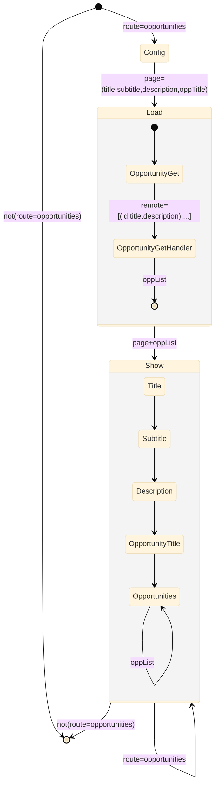

# Community

```mermaid
%%{init: {'securityLevel': 'loose', 'theme':'base'}}%%
stateDiagram
 

    state Load  {
        [*] --> OpportunityGet
        OpportunityGet --> OpportunityGetHandler : remote=[(id,title,description),...]
        OpportunityGetHandler --> [*] : oppList
    }
    state Show  {
        Title --> Subtitle
        Subtitle --> Description
        Description --> OpportunityTitle
        OpportunityTitle --> Opportunities
    }
 
 
    [*] --> [*] : not(route=opportunities)
    [*] --> Config : route=opportunities
    Config --> Load : page=(title,subtitle,description,oppTitle)
    Load --> Show : page+oppList
    Show --> [*] : not(route=opportunities)
 
Show --> Show : route=opportunities
Opportunities --> Opportunities : oppList

```
