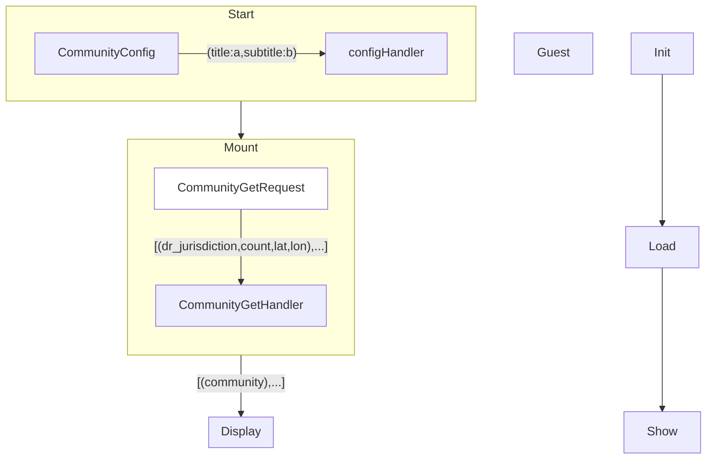

# lb-a
single nuxtjs app

## Communities

```mermaid
flowchart TB
    classDef service fill:#fff;
    
    Guest
    
    Init --> Load
    Load --> Show

    CommunityGetRequest:::service
    
    subgraph Start
      CommunityConfig --> |"(title:a,subtitle:b)"| configHandler    
    end
    
    subgraph Mount
      direction TB
     
      CommunityGetRequest --> |"[(dr_jurisdiction,count,lat,lon),...]"| CommunityGetHandler
    end
    
    subgraph Display
      direction TB
    end
    

    Start --> Mount
    Mount --> |"[(community),...]"| Display

```

