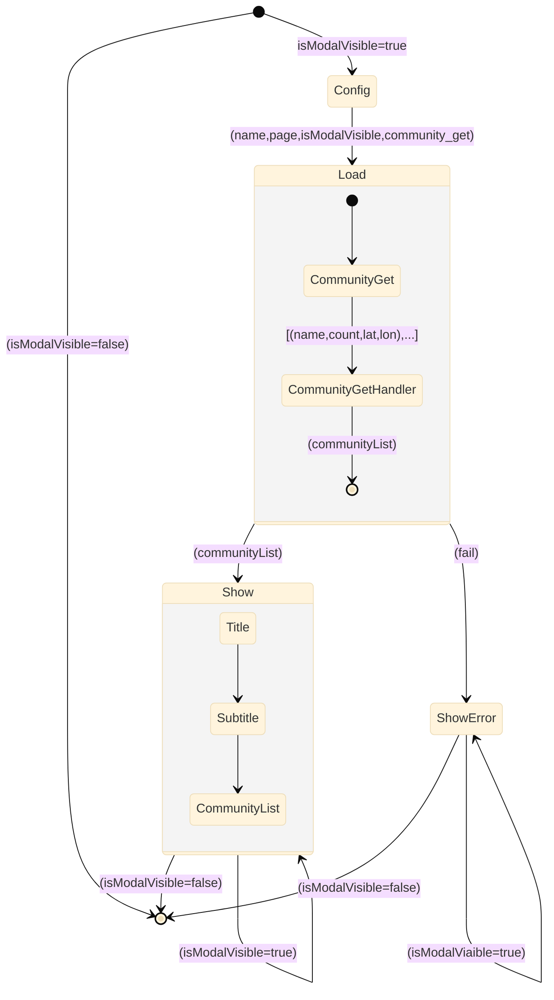
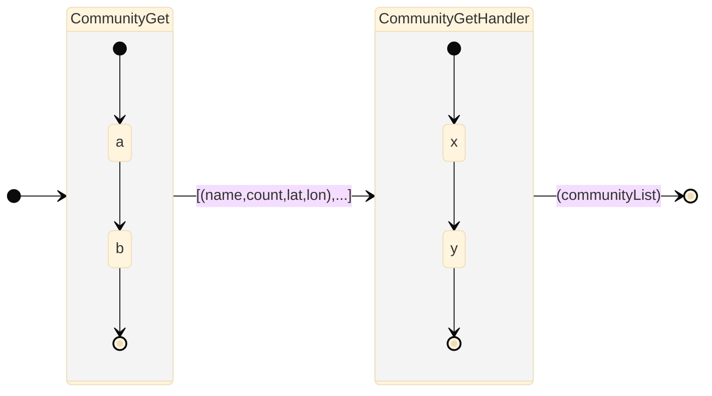

# Community

```mermaid
%%{init: {'securityLevel': 'loose', 'theme':'base'}}%%
stateDiagram
    state Load {
        [*] --> CommunityGet 
        CommunityGet --> CommunityGetHandler : [(name,count,lat,lon),...]
        CommunityGetHandler --> [*] : (communityList)
    }
    state Show {
        Title --> Subtitle 
        Subtitle --> CommunityList 
    }
   
    [*] --> [*] : (isModalVisible=false)
    [*] --> Config : isModalVisible=true
    Config --> Load : (name,page,isModalVisible,community_get)
    Load --> Show : (communityList)
    Load --> ShowError : (fail)
    ShowError --> [*] : (isModalVisible=false)
    ShowError --> ShowError : (isModalViaible=true)
    Show --> [*] : (isModalVisible=false)
    Show --> Show : (isModalVisible=true)
    
```
# Community Load

```mermaid
%%{init: {'securityLevel': 'loose', 'theme':'base'}}%%
stateDiagram
    direction LR
     state CommunityGet {
     [*] --> a
      a --> b
      b --> [*]
    }
    state CommunityGetHandler {
      [*] --> x
      x --> y
      y --> [*]
    }
    [*] --> CommunityGet 
        CommunityGet --> CommunityGetHandler : [(name,count,lat,lon),...]
        CommunityGetHandler --> [*] : (communityList)
        
        
```

