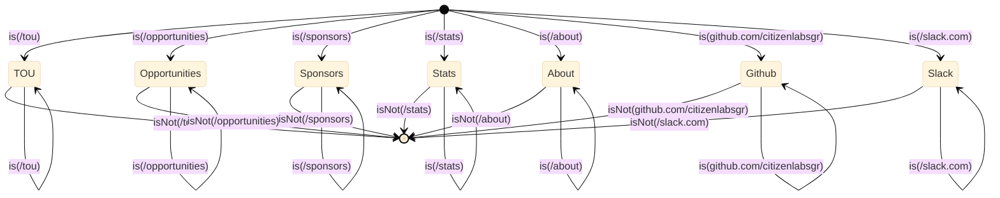
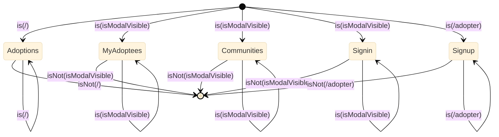
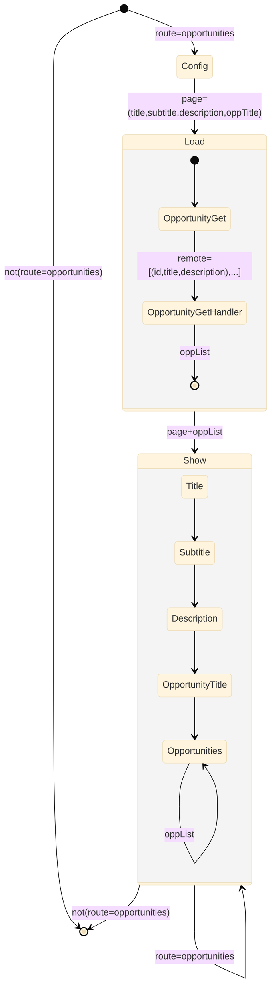

# Footer

```mermaid
%%{init: {'securityLevel': 'loose', 'theme':'base'}}%%
stateDiagram
 
        [*] --> TOU : is(/tou)
        TOU --> [*] : isNot(/tou)
        TOU --> TOU : is(/tou)
        

        [*] --> Opportunities : is(/opportunities)
        Opportunities --> [*] : isNot(/opportunities)
        Opportunities --> Opportunities : is(/opportunities)
        

        [*] --> Sponsors : is(/sponsors)
        Sponsors --> [*] : isNot(/sponsors)
        Sponsors --> Sponsors : is(/sponsors)
        

        [*] --> Stats : is(/stats)
        Stats --> [*] : isNot(/stats)
        Stats --> Stats : is(/stats)
        

        [*] --> About : is(/about)
        About --> [*] : isNot(/about)
        About --> About : is(/about)
        

        [*] --> Github : is(github.com/citizenlabsgr)
        Github --> [*] : isNot(github.com/citizenlabsgr)
        Github --> Github : is(github.com/citizenlabsgr)
        

        [*] --> Slack : is(/slack.com)
        Slack --> [*] : isNot(/slack.com)
        Slack --> Slack : is(/slack.com)
```

# Nav

```mermaid
%%{init: {'securityLevel': 'loose', 'theme':'base'}}%%
stateDiagram

        [*] --> Adoptions : is(/)
        Adoptions --> [*] : isNot(/)
        Adoptions --> Adoptions : is(/)
        

        [*] --> MyAdoptees : is(isModalVisible)
        MyAdoptees --> [*] : isNot(isModalVisible)
        MyAdoptees --> MyAdoptees : is(isModalVisible)
        

        [*] --> Communities : is(isModalVisible)
        Communities --> [*] : isNot(isModalVisible)
        Communities --> Communities : is(isModalVisible)
        

        [*] --> Signin : is(isModalVisible)
        Signin --> [*] : isNot(isModalVisible)
        Signin --> Signin : is(isModalVisible)
        

        [*] --> Signup : is(/adopter)
        Signup --> [*] : isNot(/adopter)
        Signup --> Signup : is(/adopter)
        
```

# Opportunity

```mermaid
%%{init: {'securityLevel': 'loose', 'theme':'base'}}%%
stateDiagram
 

    state Load  {
        [*] --> OpportunityGet
        OpportunityGet --> OpportunityGetHandler : remote=[(id,title,description),...]
        OpportunityGetHandler --> [*] : oppList
    }
    state Show  {
        Title --> Subtitle
        Subtitle --> Description
        Description --> OpportunityTitle
        OpportunityTitle --> Opportunities
    }
 
 
    [*] --> [*] : not(route=opportunities)
    [*] --> Config : route=opportunities
    Config --> Load : page=(title,subtitle,description,oppTitle)
    Load --> Show : page+oppList
    Show --> [*] : not(route=opportunities)
 
Show --> Show : route=opportunities
Opportunities --> Opportunities : oppList

```
