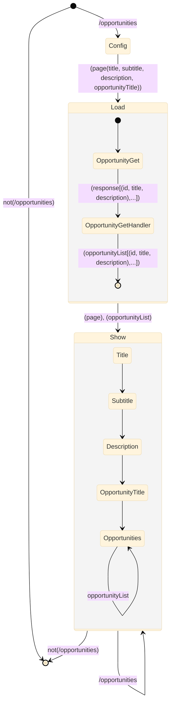
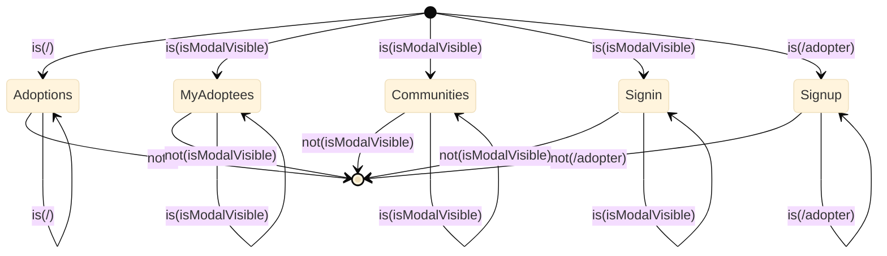
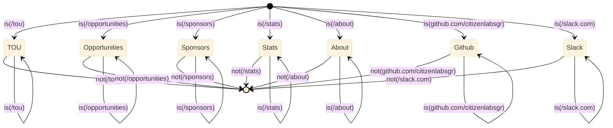
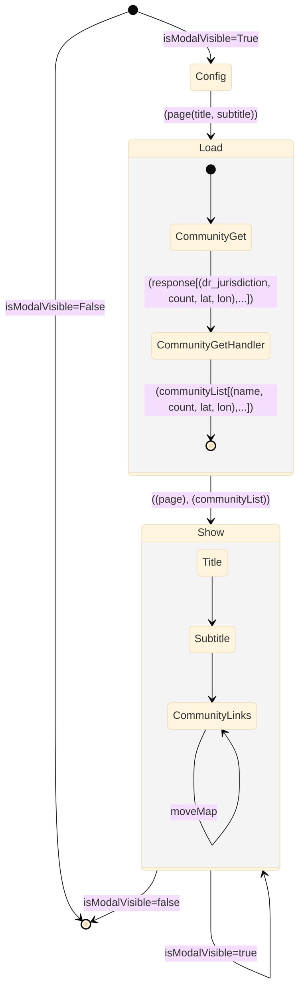
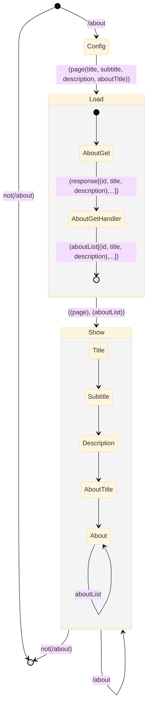

# Tou

```mermaid

```

# Stats

```mermaid

```

# Sponsors

```mermaid

```

# SignOut

```mermaid


```

# SignIn

```mermaid
```

# Header

```mermaid

```

# Opportunities



# Nav



# Footer



# Community



# About


