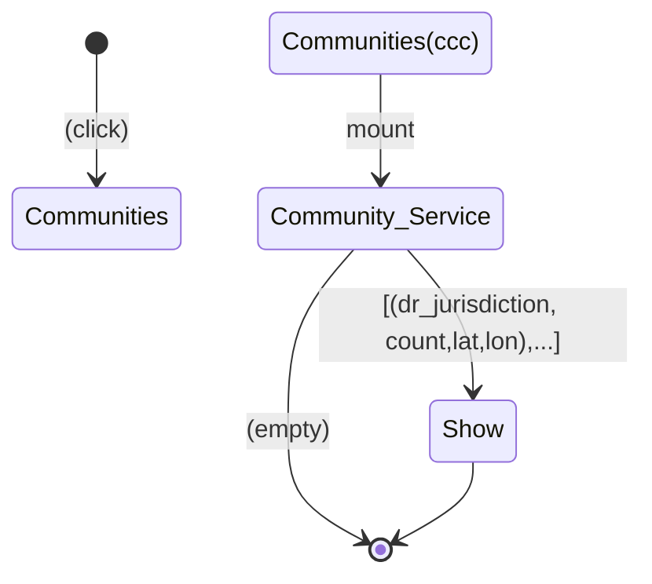

# lb-a
single nuxtjs app



```mermaid
flowchart TB
classDef service fill:#f96;
B(Task)
direction LR
B(task1) <-.- |xxx| A:::service[Service] 
B(task1)  --> |bbb| C(task2)

```
Still --> Moving
    Moving --> Still
    Moving --> Crash
    Crash --> [*]
