# System
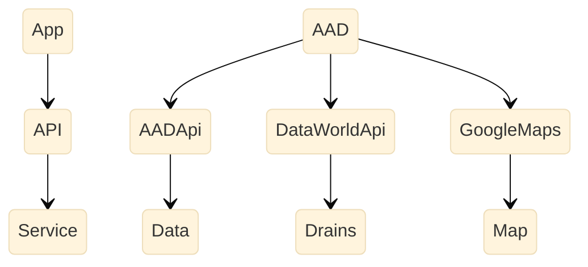

# Sponsor
 
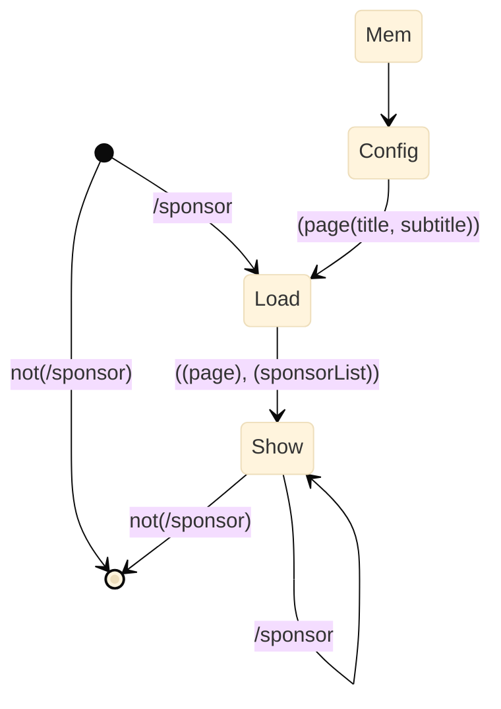
  
# Sponsor *Load
 
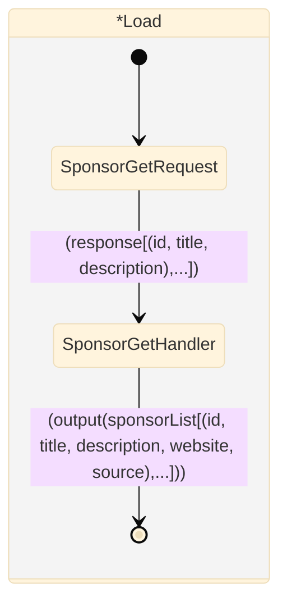
  
# Sponsor *Show
 
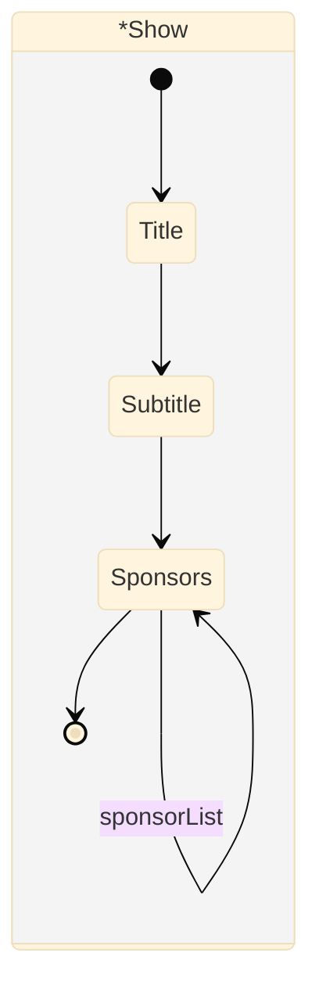
  
# Sponsor *Load
 

 
# SignOut
 
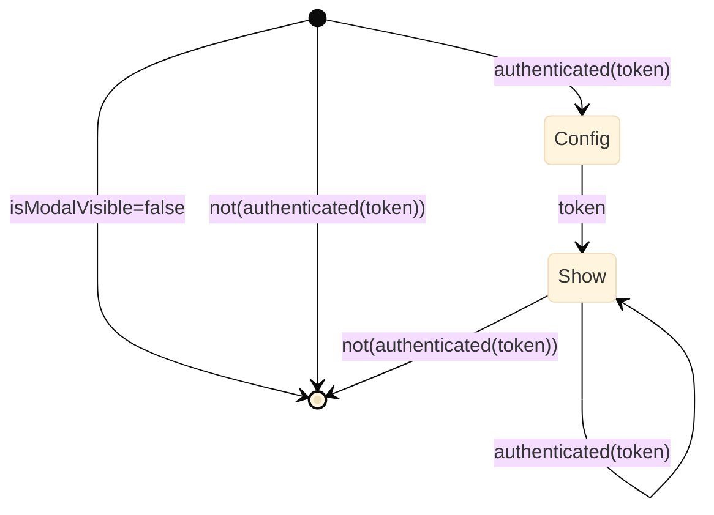


# Signin
 
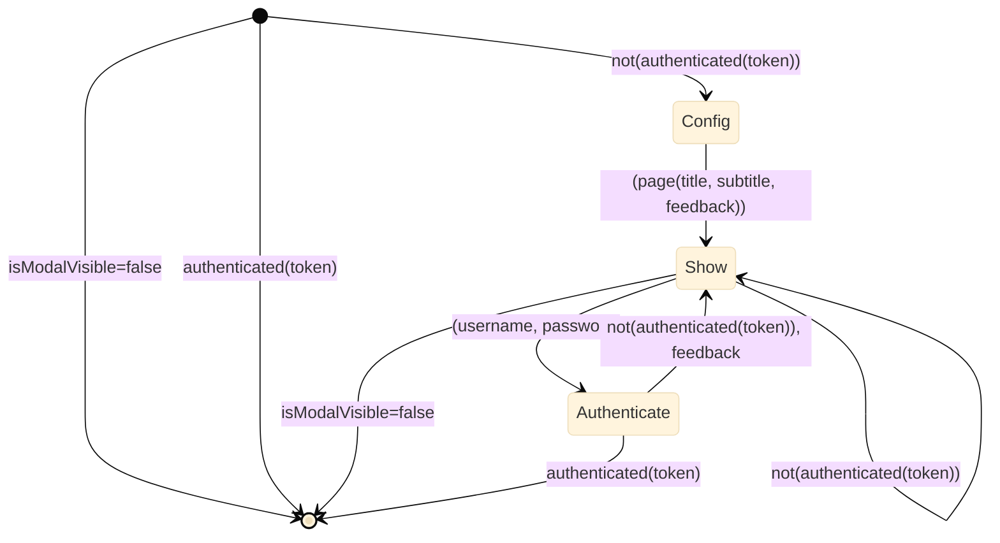
  
# Signin *Show
 
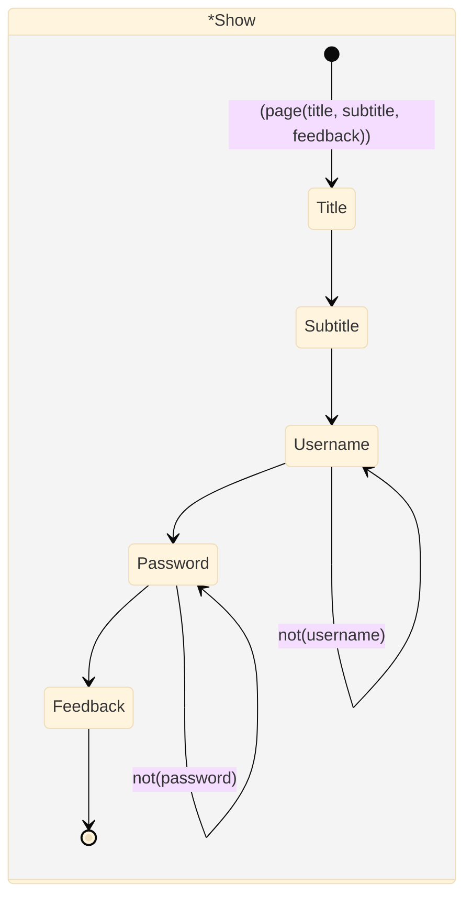
  
# Signin *Authenticate
 
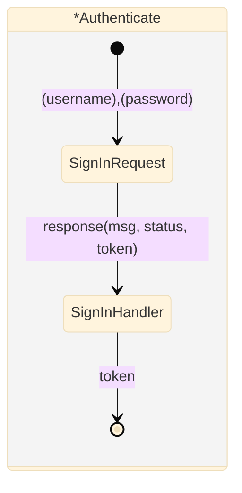

# Header
 
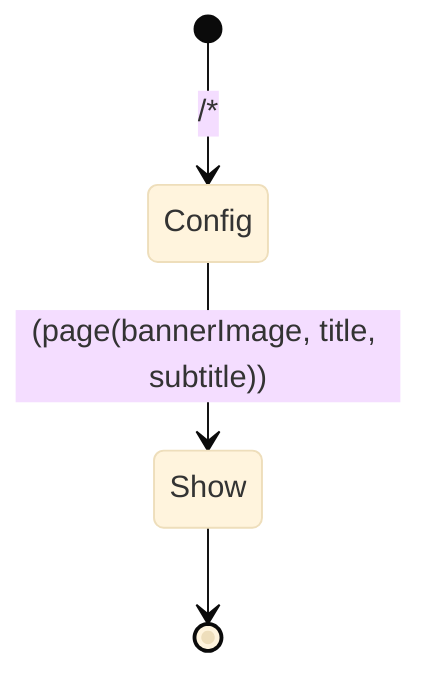
  
# Header *Show
 
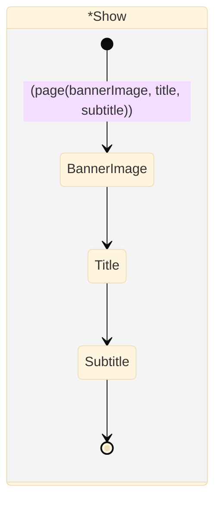

# Opportunities *Load
 
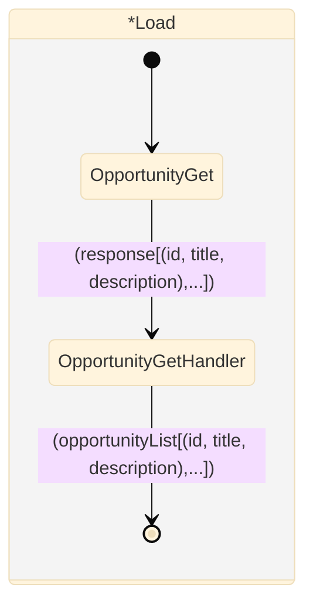
  
# Opportunities *Show
 
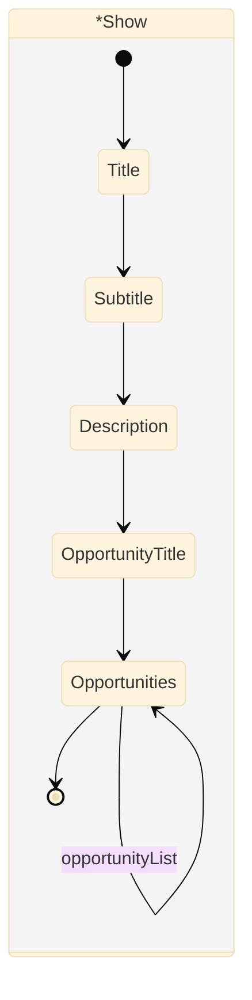

# Nav
 
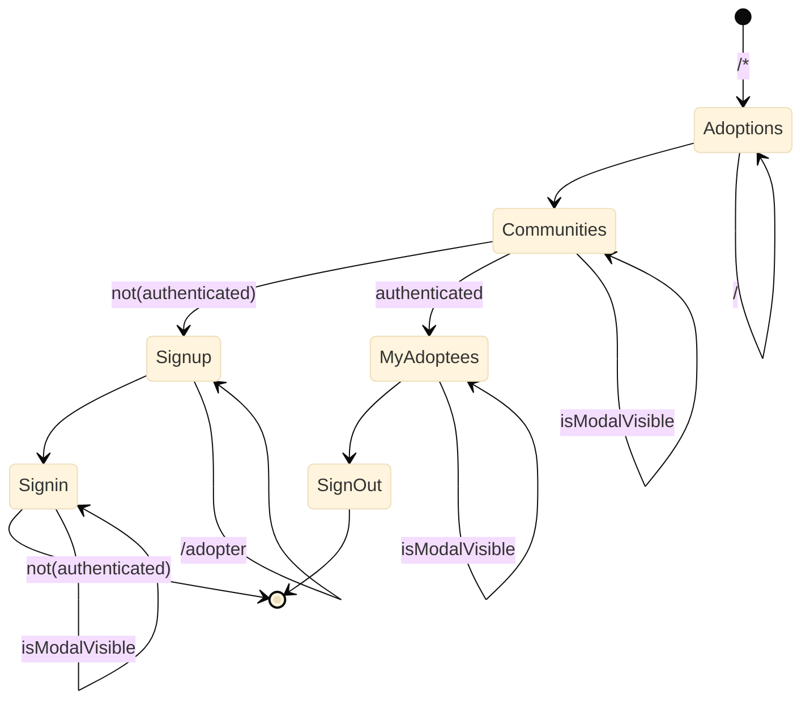


# Footer
 
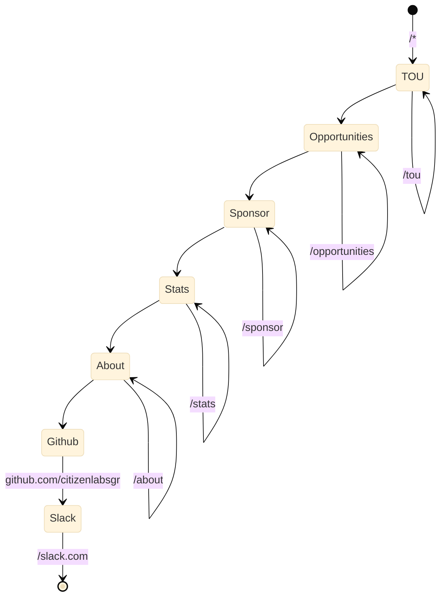

# Communities
 
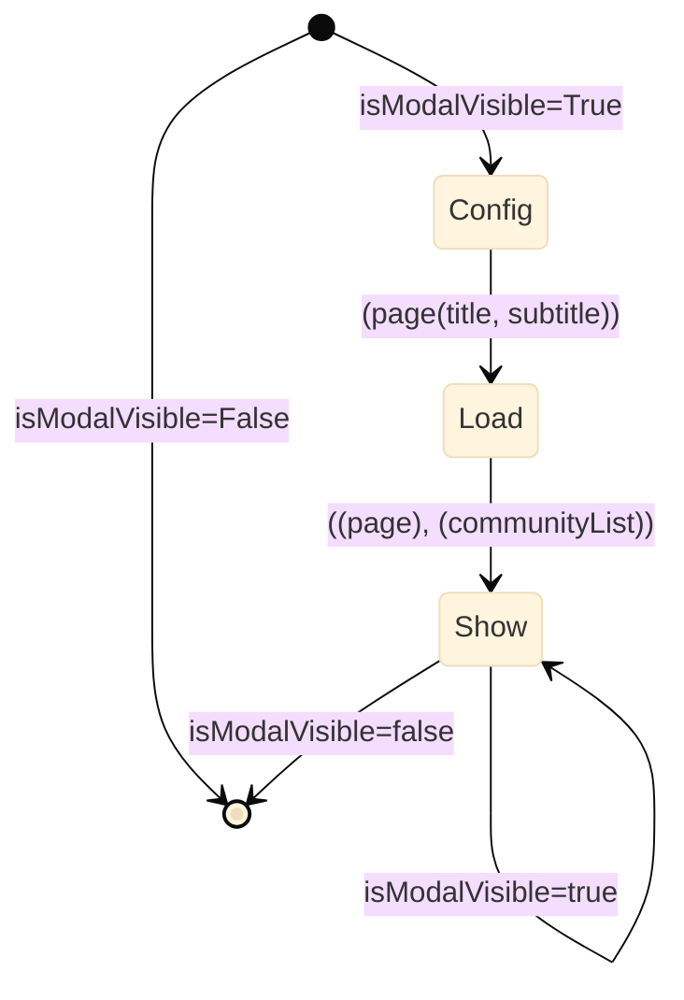
  
# Communities *Load
 
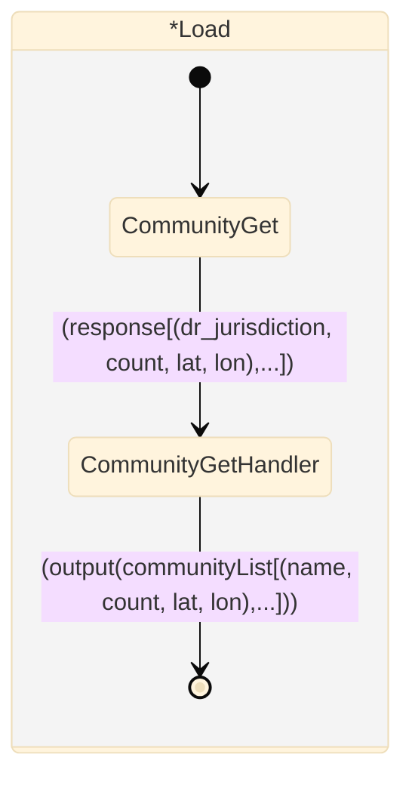
  
# Communities *Show
 
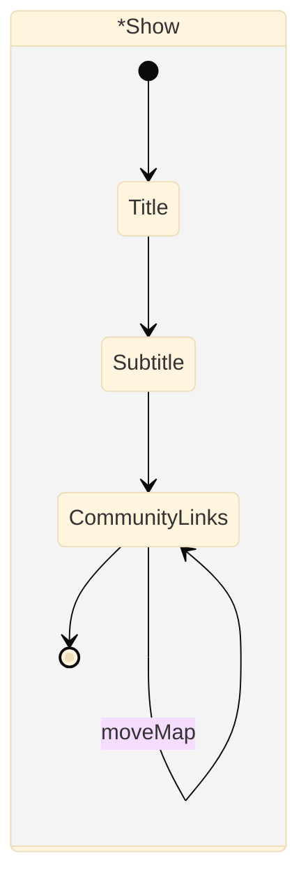

# About
 
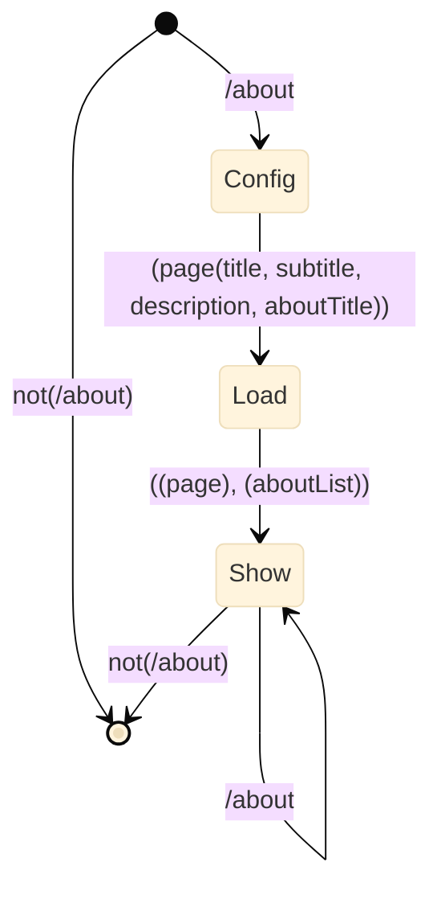
  
# About *Load
 
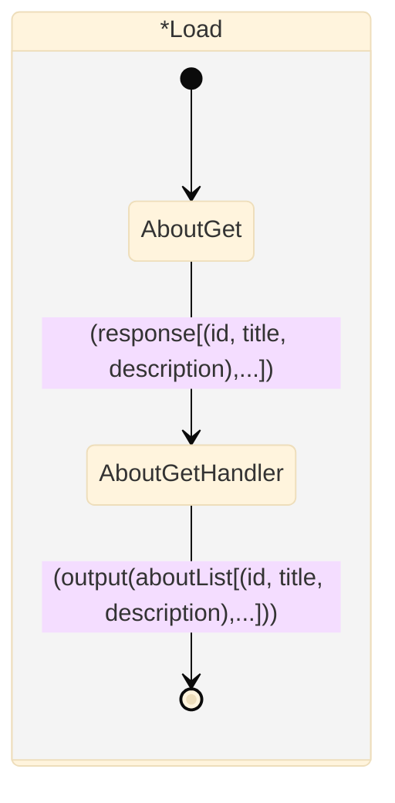
  
# About *Show
 
```mermaid

%%{init: {'securityLevel': 'loose', 'theme':'base'}}%%
stateDiagram
 
 state *Show
     {
    [*] --> Title
    Title --> Subtitle
    Subtitle --> Description
    Description --> AboutTitle
    AboutTitle --> About
    About --> [*]
  }
 
About --> About : aboutList
 
```

