# System
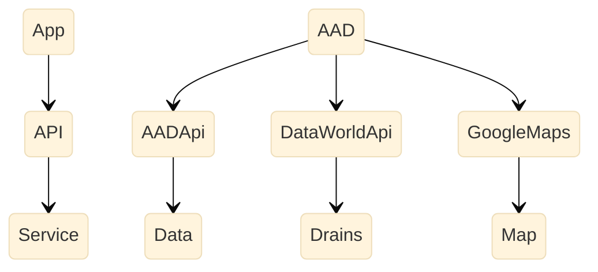

# Adoption

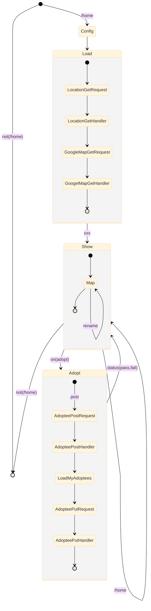

# Home
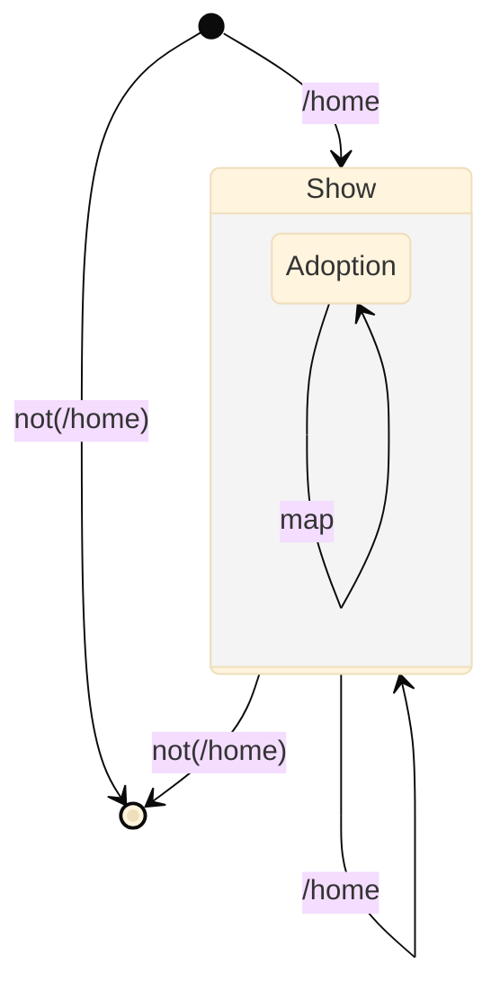

# Tou

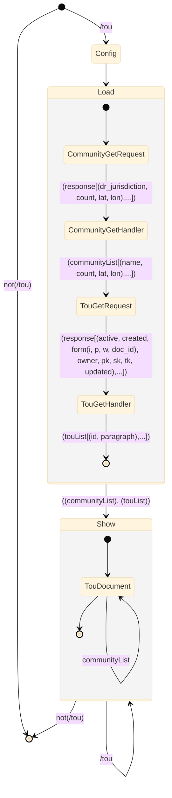

# Stats

```mermaid

```

# Sponsors

```mermaid
%%{init: {'securityLevel': 'loose', 'theme':'base'}}%%
stateDiagram
    state Load {
             
        [*] --> SponsorGet
        SponsorGet --> SponsorGetHandler : (response[(id, title, description),...])
        SponsorGetHandler --> [*] : (sponsorList[(id, title, description, website, source),...])
     }    
         
    state Show {
             
        [*] --> Title
        Title --> Subtitle
        Subtitle --> [*]
     }    
         
[*] --> [*] : not(/sponsor)
[*] --> Config : /sponsor
Config --> Load : (title, subtitle)
Load --> Show : ((page), (sponsorList))
Show --> [*] : not(/sponsor)
 
Show --> Show : /sponsor
```

# SignOut

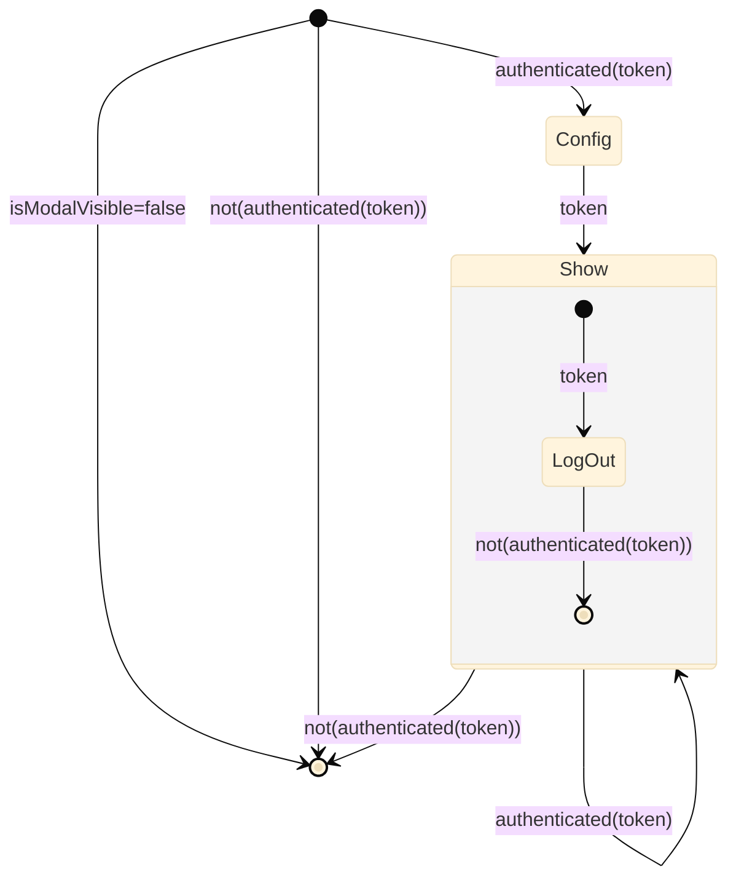

# SignIn

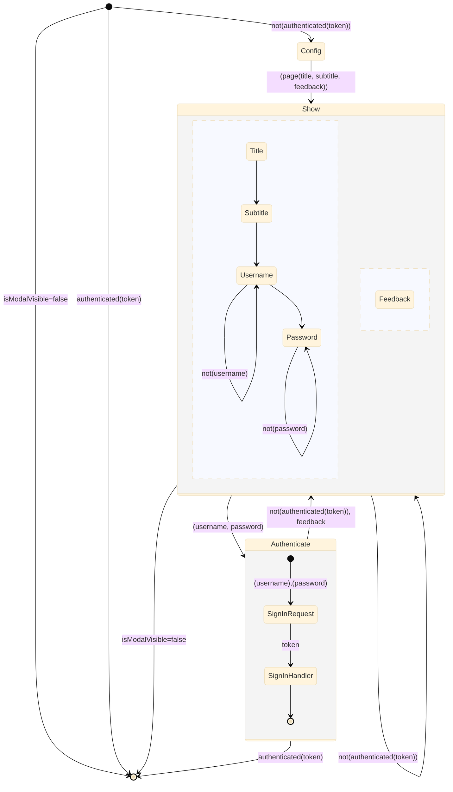

# Header

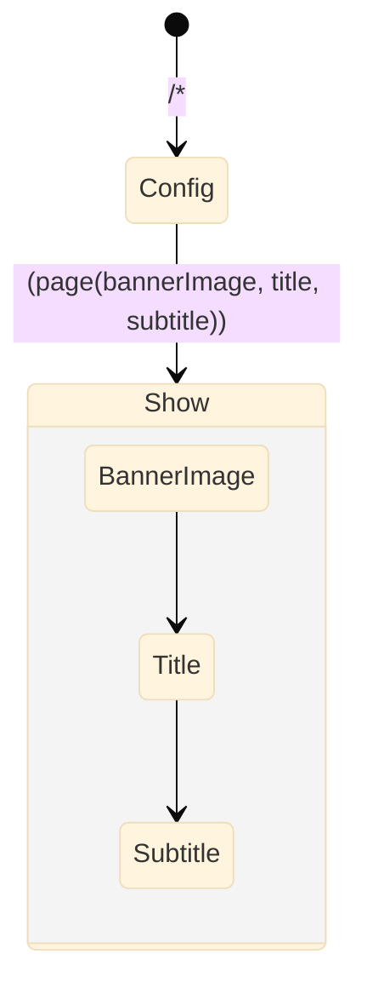

# Opportunities

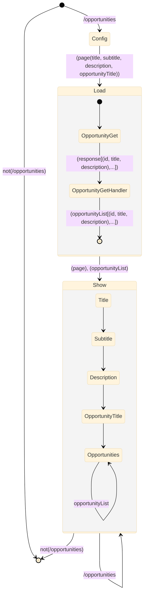

# Nav

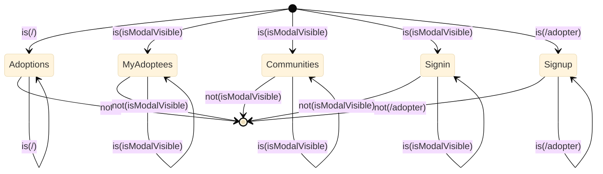

# Footer

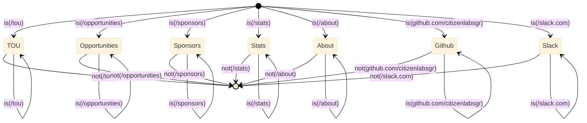

# Community

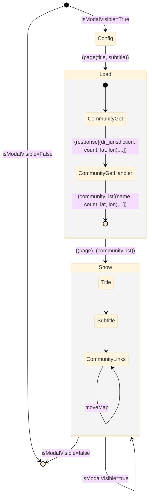

# About

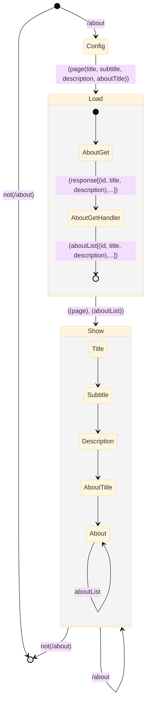
