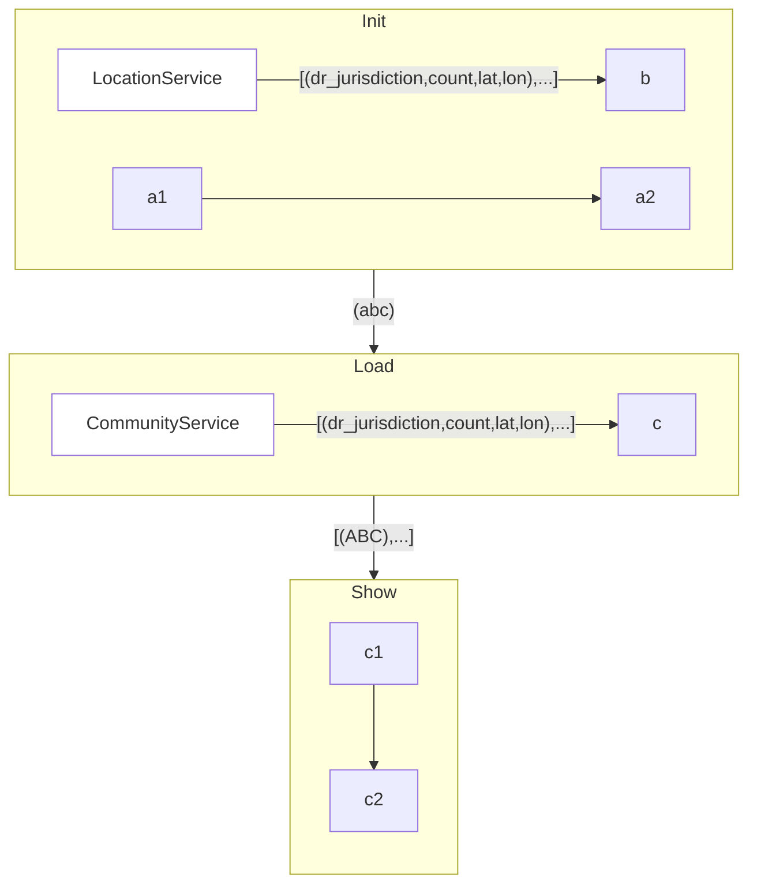
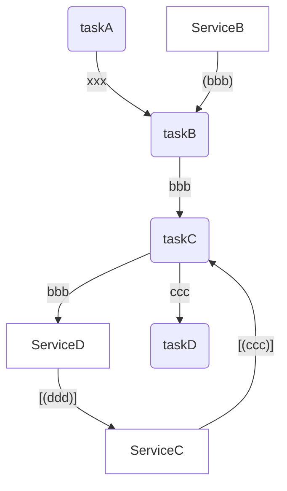
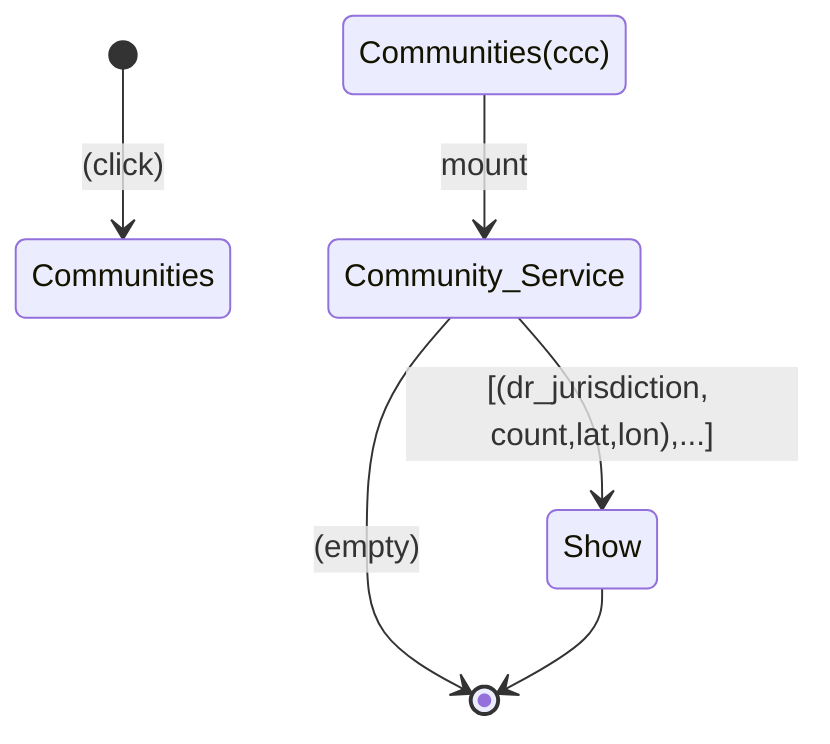

# lb-a
single nuxtjs app

```mermaid
flowchart TB
    classDef service fill:#fff;
    CommunityService:::service
    LocationService:::service
    
    subgraph Init
      direction LR
      LocationService --> |"[(dr_jurisdiction,count,lat,lon),...]"| b
      a1-->a2
    end
    
    subgraph Load
      CommunityService --> |"[(dr_jurisdiction,count,lat,lon),...]"| c
            
    end
    
    subgraph Show
      direction TB

      c1-->c2
    end
    
    Init --> |"(abc)"| Load
    Load --> |"[(ABC),...]"| Show
    
    
```

```mermaid
flowchart TB


classDef service fill:#fff;
BB:::service
CC:::service
DD:::service

A(taskA) --> |xxx| B(taskB)
B(taskB) --> |bbb| C(taskC)
C(taskC) --> |ccc| D(taskD)
C(taskC) --> |bbb| DD[Service]

BB[ServiceB] --> |"(bbb)"| B
CC[ServiceC] --> |"[(ccc)]"| C
DD[ServiceD] --> |"[(ddd)]"| CC
```

```mermaid
stateDiagram
    [*] --> Communities: (click)
     
    Communities(ccc) --> Community_Service: mount
    
    Community_Service --> Show: [(dr_jurisdiction, count,lat,lon),...]
    Community_Service --> [*]: (empty)

    Show --> [*]
```
