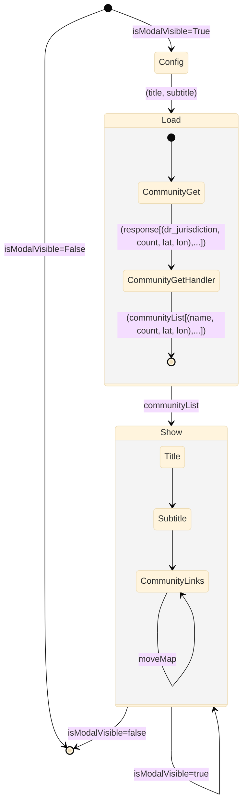
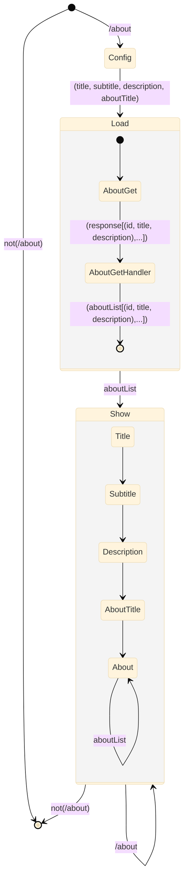

# Nav

```mermaid

```

# Footer

```mermaid

%%{init: {'securityLevel': 'loose', 'theme':'base'}}%%
stateDiagram
 

        [*] --> TOU : is(/tou)
        TOU --> [*] : isNot(/tou)
        TOU --> TOU : is(/tou)
        

        [*] --> Opportunities : is(/opportunities)
        Opportunities --> [*] : isNot(/opportunities)
        Opportunities --> Opportunities : is(/opportunities)
        

        [*] --> Sponsors : is(/sponsors)
        Sponsors --> [*] : isNot(/sponsors)
        Sponsors --> Sponsors : is(/sponsors)
        

        [*] --> Stats : is(/stats)
        Stats --> [*] : isNot(/stats)
        Stats --> Stats : is(/stats)
        

        [*] --> About : is(/about)
        About --> [*] : isNot(/about)
        About --> About : is(/about)
        

        [*] --> Github : is(github.com/citizenlabsgr)
        Github --> [*] : isNot(github.com/citizenlabsgr)
        Github --> Github : is(github.com/citizenlabsgr)
        

        [*] --> Slack : is(/slack.com)
        Slack --> [*] : isNot(/slack.com)
        Slack --> Slack : is(/slack.com)
```

# Community



# About



# SignIn


# SignIn


# Header 

# About


# Community

# Footer


# Nav


# Opportunity

