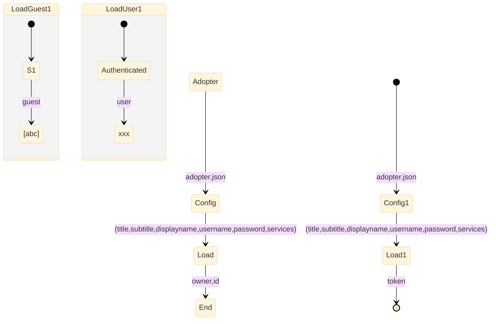

# lb-a
single nuxtjs app

## Communities



```mermaid
flowchart TB
 
    classDef service fill:#fff;
 
    
        subgraph *
          direction LR
          
        end
    
        subgraph Config1
          direction LR
              CommunityConfig[CommunityConfig] --> CommunityConfigHandler[CommunityConfigHandler]
        end
    
        subgraph Load1
          direction LR
              Community[Community] --> |"[(name,count,lat,lon),...]"| CommunityGETHandler[CommunityGETHandler]
        end
    
        subgraph Show1
          direction LR
              Click_Community[Click Community] --> Go_To_Community_Map[Go To Community Map]
        end
 
        Community --> Config
        Config --> Load
        Load --> Show
        Show --> End
 
        * --> Config1
        Config1 --> Load1
        Load1 --> Show1
        Show1 --> =

```

```mermaid
flowchart TB
    classDef service fill:#fff;
    classDef function fill:#ccc;
    classDef data fill:#aaa;
    
    Start --> Load
    Load --> Show
    Show --> End
    
    A1:::function 
    A3:::service
    
subgraph Load1
        direction LR
        CommunityConfig --> |"(title,subtitle)"| CommunityConfigHandler
CommunityGETRequest --> |"(name)"| CommunityGETHandler        
      end
     
     
    * --> Load1
    Load1 --> |"(config),[(community),...]"| Show1
    Show1 --> =
    
    

    
    A --> Legend
    Legend --> B
    B --> C
    
```

