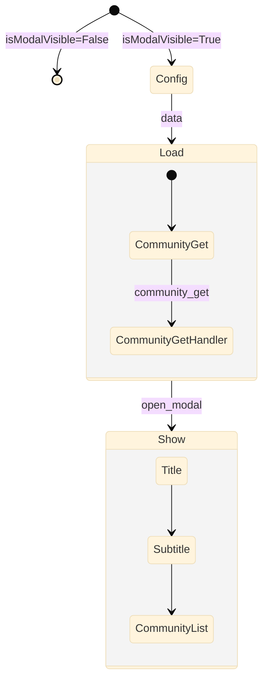
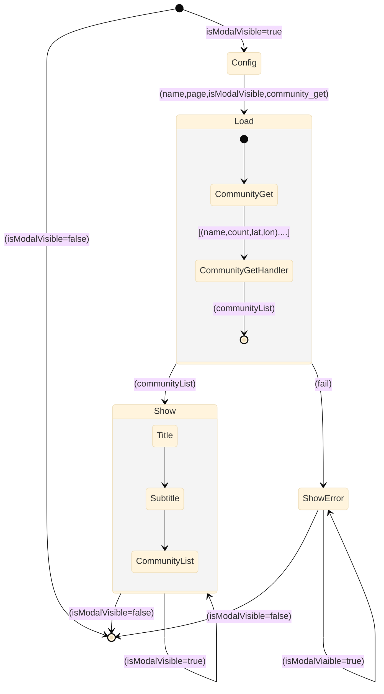
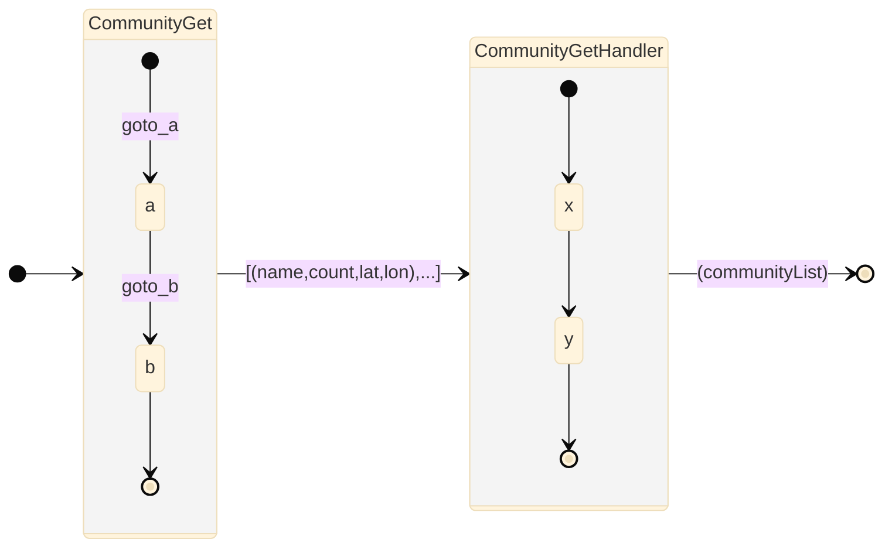

# Community

```mermaid
%%{init: {'securityLevel': 'loose', 'theme':'base'}}%%
stateDiagram
 
    state Load {
        [*] --> CommunityGet
        CommunityGet --> CommunityGetHandler : community_get
    }
    state Show {
        Title --> Subtitle
        Subtitle --> CommunityList
    }
 
    [*] --> [*] : isModalVisible=False
    [*] --> Config : isModalVisible=True
    Config --> Load : data
    Load --> Show : open_modal
```

```mermaid
%%{init: {'securityLevel': 'loose', 'theme':'base'}}%%
stateDiagram
    state Load {
        [*] --> CommunityGet 
        CommunityGet --> CommunityGetHandler : [(name,count,lat,lon),...]
        CommunityGetHandler --> [*] : (communityList)
    }
    state Show {
        Title --> Subtitle 
        Subtitle --> CommunityList 
    }
   
    [*] --> [*] : (isModalVisible=false)
    [*] --> Config : isModalVisible=true
    Config --> Load : (name,page,isModalVisible,community_get)
    Load --> Show : (communityList)
    Load --> ShowError : (fail)
    ShowError --> [*] : (isModalVisible=false)
    ShowError --> ShowError : (isModalViaible=true)
    Show --> [*] : (isModalVisible=false)
    Show --> Show : (isModalVisible=true)
    
```
# Community Load

[[Start]]

...

[[Load]]

[Start]

[CommunityGet]

Edge: a, goto_a

[CommunityGetHandler]

Edge: 

[End]

...

[[End]]

```mermaid
%%{init: {'securityLevel': 'loose', 'theme':'base'}}%%
stateDiagram
    direction LR
     state CommunityGet {
     [*] --> a : goto_a
      a --> b : goto_b
      b --> [*] : 
    }
    state CommunityGetHandler {
      [*] --> x
      x --> y
      y --> [*]
    }
    [*] --> CommunityGet 
        CommunityGet --> CommunityGetHandler : [(name,count,lat,lon),...]
        CommunityGetHandler --> [*] : (communityList)
        
        
```

